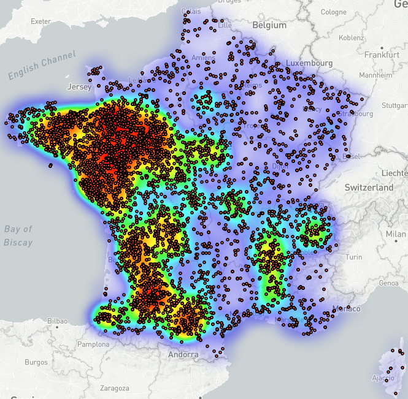
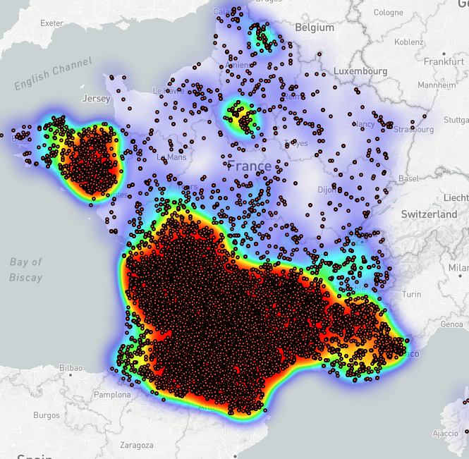
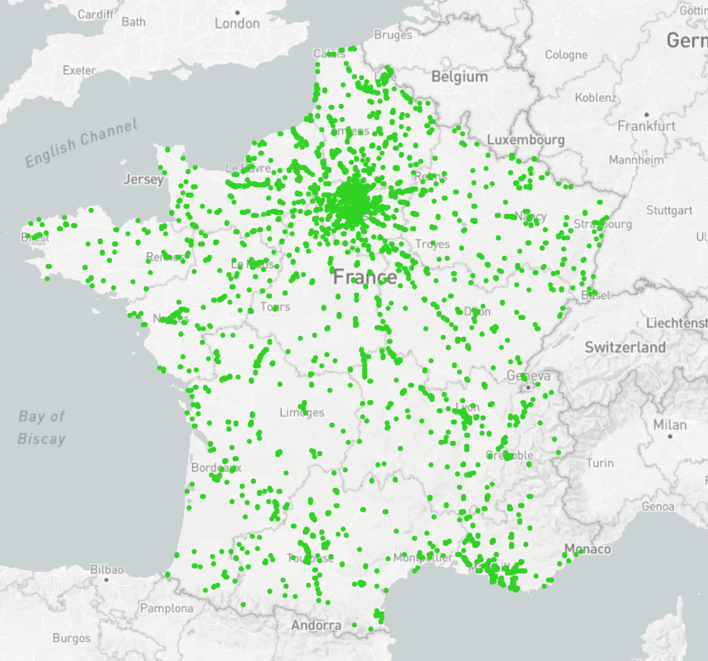
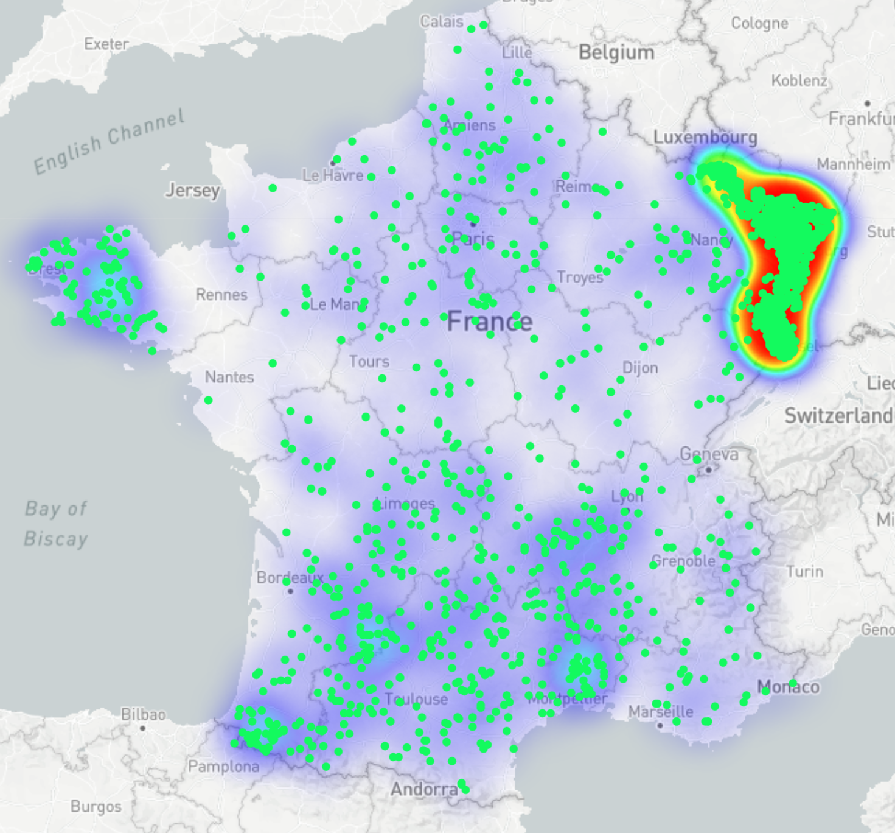

# Bien démarrer avec Topomine

L'application est disponible à l'adresse : 
[https://app.ptm.huma-num.fr/topomine/](https://app.ptm.huma-num.fr/topomine/){target="_blank"}

## Recherche

Les fonctionnalités de recherche et d'affichage proposées par Topomine sont relativement simples et directes. L'interface présente, dans sa partie supérieure, une barre de recherche centrale à partir de laquelle l'utilisateur peut entrer un texte qu'il souhaite rechercher, le texte étant généralement en relation avec la recherche d'un toponyme donné. L'action de la touche *Entrée* ou du bouton *Rechercher* va déclencher une recherche. Si des résultats sont disponibles pour la recherche effectuée, une couche de données s'affiche alors au sein de la visualisation cartographique ainsi que dans la zone de gestion des couches, située dans la partie gauche de l'application.

Les options de recherche avancée sont disponibles à partir du bouton situé à droite de la barre de recherche, de manière à pouvoir sélectionner une ou plusieurs bases de données parmi celles proposées afin d'effectuer la recherche, mais également des modes plus avancés de recherche.

## Recherche avec métacaractères

Les métacaractères ou jokers sont des caractères spécifiques permettant d'effectuer des recherches à partir d'un mot, d'un terme ou d'une expression incomplète. Ils autorisent ainsi de combler une partie manquante contenue au sein d'une chaîne de caractères, et donc par extension, favorisent une interrogation plus souple de corpus linguistiques. Par défaut, Topomine propose deux métacaractères que les utilisateurs peuvent utiliser pour effectuer des recherches avancées.

Le premier métacaractère est le caractère tiret bas (underscore en anglais), symbolisé par **_**. Celui-ci permet de combler un unique caractère manquant. Par exemple la recherche du terme **gr_s** recherche les formes gr**a**s, gr**b**s, gr**c**s, etc. Les toponymes **gras**, **gris** et **gros** sont alors révélés, cartographiés et assemblés au sein d'une même couche résultante.

Le second métacaractère est le caractère astérisque, symbolisé par **\***. Ce dernier permet de remplacer un ou plusieurs caractères. La requête **gr*s** renvoie ainsi des résultats plus hétérogènes : les mêmes **gras**, **gris** et **gros** (un ensemble de caractères pouvant aussi être un unique caractère), mais aussi par exemple et non exhaustivement **grais**, **grandvilliers**, **graviras**, etc., des toponymes contenant des espaces, *e.g.* **grande lyes**, **grands champs**, etc., voire même des toponymes contenant des tirets à l'image de **gros-bois** par exemple. En résumé, tous les toponymes qui commencent par **gr** et qui se terminent par un **s** sont considérés comme des résultats valides.

Dès lors, il est possible d'interroger les bases à partir de préfixes et/ou de suffixes. Par exemple, tous les toponymes ayant pour préfixe **belle-** sont accessibles à l'aide de la requête **belle\***, et l'ensemble des toponymes ayant pour suffixe **-ac** le sont à l'aide la requête **\*ac**. Les résultats cartographiques suivants illustrent de telles fonctionnalités de recherche.

| { .image-center width=100% loading=lazy } | { .image-center width=100% loading=lazy } |
|:--:|:--:|
| Toponymes avec un préfixe en **belle-** | &nbsp;Toponymes avec un suffixe en **-ac**&nbsp;&nbsp; |

## Recherche avancée par expression régulière

Une utilisation de Topomine plus avancée est possible grâce à l'emploi d'expressions régulières ou regex[^1]. Celles-ci fournissent un moyen simple de repérer des schémas dans une chaîne de caractères en utilisant d'autres métacaractères et/ou des opérateurs qui, une fois assemblés, permettent d'aller encore plus loin dans l'interrogation des bases de données toponymiques. Cette fonctionnalité s'active en sélectionnant l'option "Expression Régulière" disponible dans la recherche avancée de Topomine.

[^1]: Différents guides sont disponibles décrivant les caractères et opérateurs d'expressions régulières, tel que par exemple [le guide proposé par Mozilla](https://developer.mozilla.org/fr/docs/Web/JavaScript/Guide/Regular_Expressions/Cheatsheet){target="_blank"}

Grâce à ces expressions, il devient par exemple possible :

- de rechercher parmi les toponymes un préfixe à l'aide de l'opérateur **^** (accent circonflexe) qui indique le début d'une chaîne de caractères, ou un suffixe à l'aide de l'opérateur **$** (dollar) qui indique la fin d'une chaîne de caractères. Ainsi les requêtes **^belle** et **ac$** renverront respectivement les toponymes de préfixe en belle- et de suffixe -ac,
- d'utiliser des opérateurs booléens, en particulier le caractère **|** (barre verticale, appelée encore "pipe") pour l'opérateur **OU** en logique booléenne. Ainsi la requête **paris|marseille** renverra tous les toponymes contenant **paris** ou **marseille**. Dans les expressions régulières, contrairement à la recherche simple, la recherche n'est pas stricte. Sur une recherche portant sur la base des *Voies nommées*, les résultats renvoyés seront par exemple : tous les odonymes relatifs à Paris comme "rue de paris", "avenue de paris",  "route de paris à genève", etc. mais aussi ceux relatifs à Marseille comme "route de nîmes à marseille", "rue jean marseille", etc., tel qu'illustré dans la représentation cartographique ci-dessous.

<figure markdown>
  { .image-center width=60% loading=lazy }
  <figcaption>Odonymes des routes portant les termes Paris ou Marseille</figcaption>
</figure>

- de rechercher spécifiquement des termes avec des variations de voyelles, avec par exemple l'expression **gr[aio]s**. Les voyelles entre crochets sont considérés comme possibilités de remplacement. De la même façon, nous retrouverons tous les toponymes contenant **gras**, **gris** et **gros**, qui seront renvoyés de manière non stricte,
- d'effectuer une recherche stricte, la requête **^paris$** ne renverra que les toponymes ne contenant strictement que **paris**,
- de combiner des termes et des opérateurs pour effectuer une recherche plus avancées comme de tous les toponymes commençant par n'importe quelle lettre de l'alphabet, finissant par une voyelle qui n'est pas un **y** et d'une longueur de **12 caractères**. La requête suivante **^[a-z]{12}[aeiou]\$** permet cette interrogation et est représentée sur la figure ci-dessous.

<figure markdown>
  { .image-center width=60% loading=lazy }
  <figcaption>Toponymes d'une longueur de 12 caractères se terminant par une voyelle autre que y</figcaption>
</figure>

Pour aller plus loin, consulter la page [Requêtes](./requetes.md).
